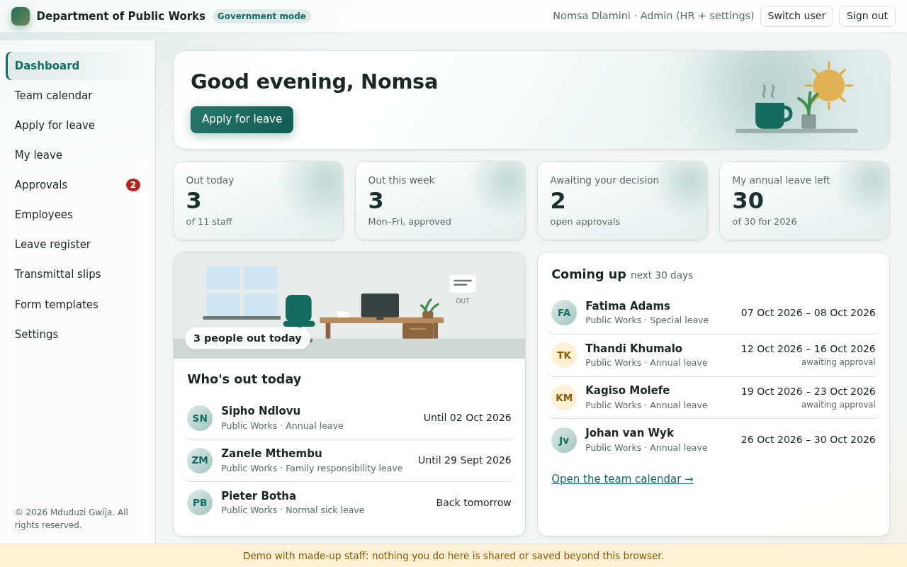
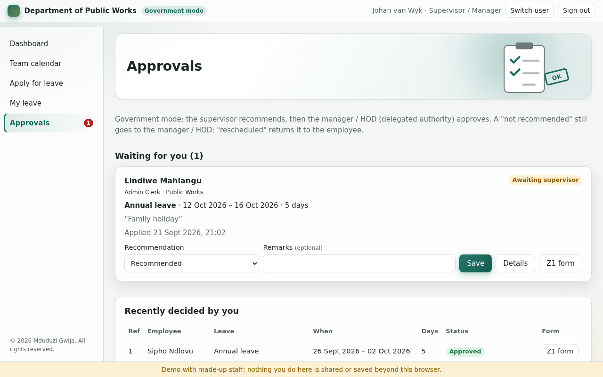
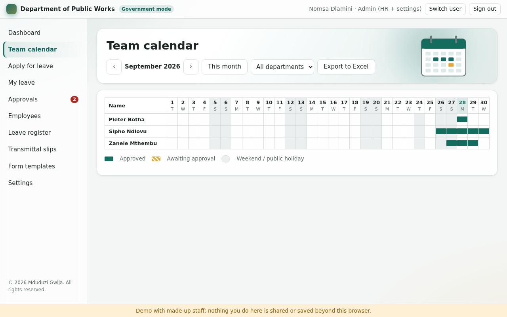
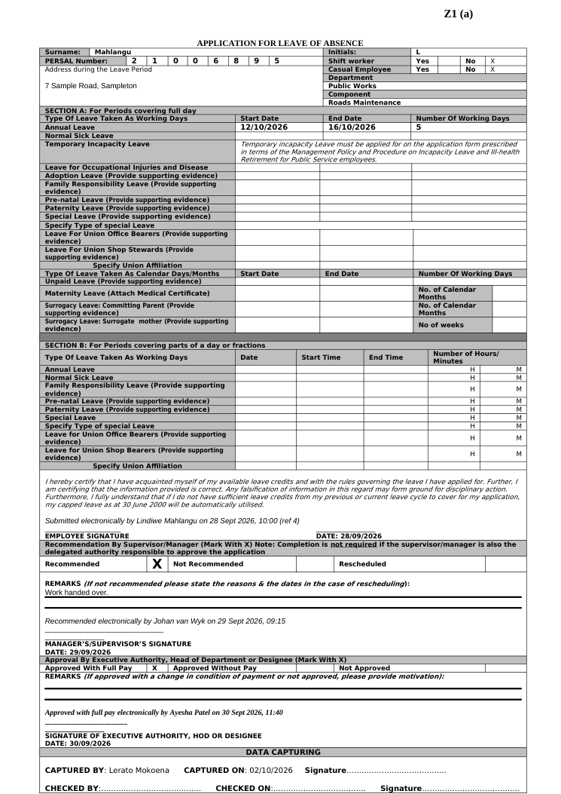
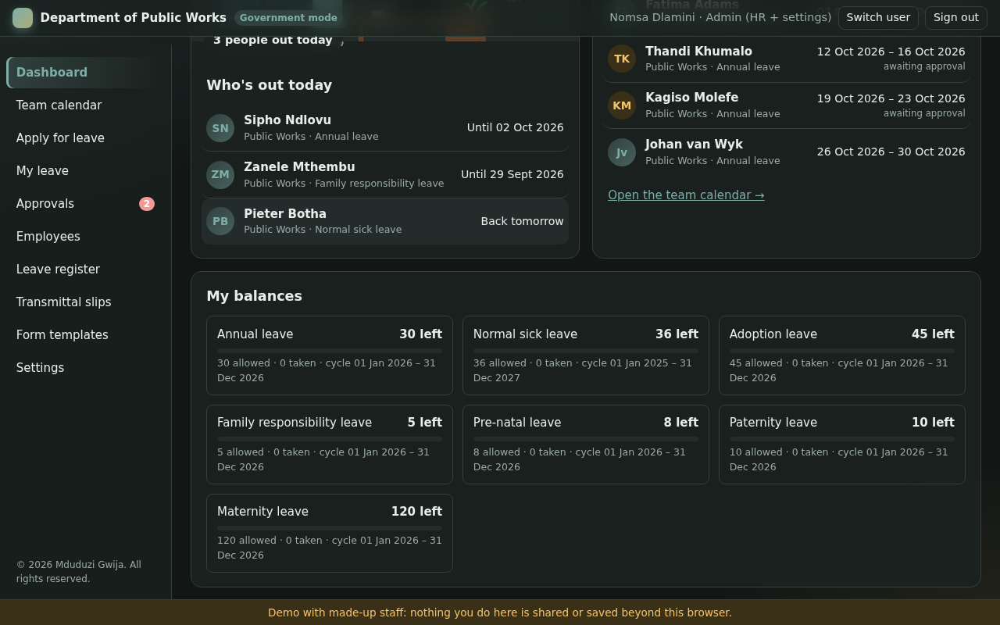
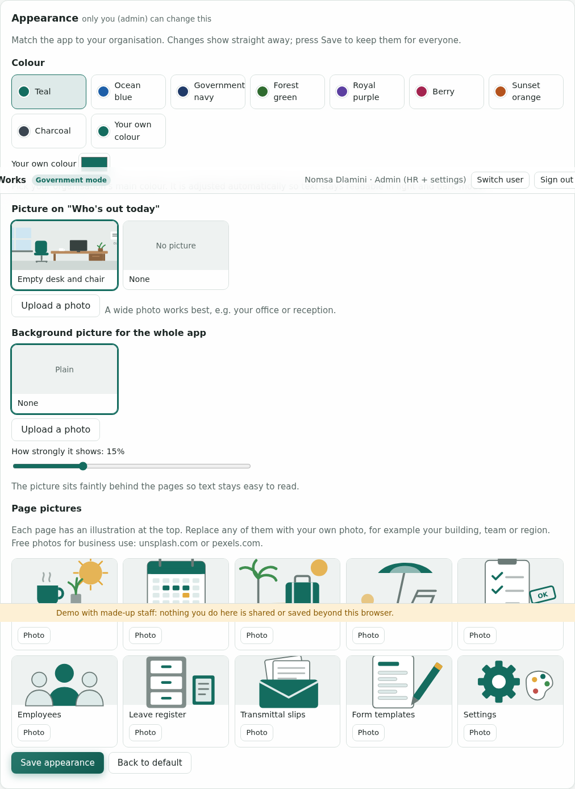
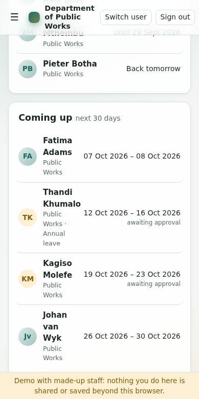

# Leave Management / HR App

**Leave management and HR records for South African workplaces, from the public service's paper Z1(a) process to paperless private-sector leave.**

**[▶ Try the live demo](https://mduduzigwija.github.io/Leave-Management-App/demo/)** (made-up staff, runs in your browser, nothing is shared)

> © 2026 Mduduzi Gwija. All rights reserved. This is proprietary software: it may not be copied, used, modified or distributed without written permission. See [LICENSE](LICENSE).



## Highlights

- **Two ways of working, one switch.** *Government mode* follows the public service process: the Z1(a) leave form, a supervisor who recommends and a manager / HOD who approves, then HR receives the forms on a transmittal slip. *Enterprise mode* is paperless with one approver and BCEA leave.
- **Fills in the real paper forms.** Produces the department's own Z1(a) and transmittal slip as Word documents: PERSAL digits in their boxes, X marks, decisions, dates and e-signature lines, ready to print and sign. Any department can upload its own Word template.
- **Permissions enforced by the database.** Staff see who is out, but not why. Supervisors see only their team's requests. Private details (ID and PERSAL numbers, addresses) are visible to HR and the employee only. Nobody can approve their own leave or skip a step.
- **South African leave rules built in.** Working days skip weekends and public holidays (including Easter and Sunday-observed holidays). Leave cycles, the 3-year sick-leave cycle, 30 days' annual leave after 10 years in the public service, part-day leave (Section B), and shared parental leave after the Constitutional Court's *Van Wyk* judgment (2025).
- **A full leave log.** Every application records who did what and when. Balances, a team calendar and exports to Excel.
- **Made to look like the organisation.** Admin-chosen colours, illustrated pages or your own photos, light and dark mode, and it works on phones.

| Approvals | Team calendar |
| --- | --- |
|  |  |
| **Filled-in Z1(a) leave form** | **Dark mode** |
|  |  |
| **Appearance settings** | **On a phone** |
|  |  |

**Built with:** plain JavaScript (ES modules, no framework or build step), HTML and CSS; [Supabase](https://supabase.com) (PostgreSQL with row-level security, authentication and file storage) for data; [docxtemplater](https://docxtemplater.com) for Word documents; a small in-browser Excel writer; GitHub Actions and GitHub Pages for tests and hosting. Tested with Node's test runner, Playwright browser tests and a local PostgreSQL copy of the database.

## What it does

| Who | What they can do |
| --- | --- |
| **Everyone** | Dashboard: who's out today, who's out this week, who plans to be out in the next 30 days. Team calendar by month. Other people's leave shows names and dates only, never the leave type or reason. |
| **Staff** | Apply for leave (full days, or part of a day as on Section B of the Z1). See their own balances, history and the leave log of every request (who did what, when). Cancel pending leave. **Return early** from approved leave (unused days go back to the balance), and accept or decline a recall request in enterprise mode. Download their own filled-in Z1 form. Export their leave to Excel. |
| **Supervisor / manager** | Recommend (supervisor), then approve (manager / HOD), using the exact Z1 wording: *Recommended / Not recommended / Rescheduled*, then *Approved with full pay / Approved without pay / Not approved*. Remarks are optional, except when refusing. Nobody can approve their own leave. **Recall** someone from approved leave with a reason (and costs to claim in government mode): it applies at once in government mode, and in enterprise mode it is a request the employee must accept (BCEA s20(9)). |
| **HR** | Employee records, including private details (PERSAL number, ID number, address, salary level) that only HR and the employee can see. Set leave allowances and carried-over days per person. Leave register with filters and Excel export. Put approved forms on a **transmittal slip** and download the slip plus all forms (.zip). Mark forms captured / checked. Upload the department's own Word templates. Manage public holidays. |
| **Admin** | Everything HR can do, plus changing roles, the government / enterprise switch, organisation details, leave types and appearance. |

**Appearance (admin only, Settings → Appearance):** choose a colour palette or your organisation's own colour (adjusted automatically so text stays readable in light and dark mode). Show an illustrated empty desk and chair, or your own photo, on *Who's out today*. Add a faint background photo behind the whole app, and replace any page's illustration with a photo. Photos are shrunk in the browser before upload. Free photos for business use: [unsplash.com](https://unsplash.com), [pexels.com](https://pexels.com).

*Existing installs:* run each file in [`supabase/updates/`](supabase/updates/) once, in order, in the SQL Editor (001 adds the appearance settings and picture storage; 002 lets approvers print the complete Z1 by storing the applicant's PERSAL number on each application; 003 adds who-can-take-which-leave, the optional gender field and shared parental leave; 004 adds return early and recall).

**Who can take which leave:** each leave type can be limited to one mode and, where only a birth mother can take it (pre-natal, maternity, surrogate mother), to women. HR can record an employee's gender (optional); if it is not recorded nothing is hidden. Commissioning-parent (surrogacy), adoption, paternity and parental leave are open to any parent. Following the Constitutional Court's *Van Wyk* judgment (3 October 2025), enterprise mode has one **Parental leave** type: parents share 4 months and 10 days. The public service is awaiting final DPSA direction (interim circular, January 2026), so government mode keeps the Z1 leave types until the admin switches parental leave on.

Leave days are counted as working days: weekends and South African public holidays are skipped (maternity and surrogacy leave count calendar days). Balances follow the leave cycle: calendar year for annual leave, a 3-year cycle for sick leave. Annual leave in government mode rises from 22 to 30 days after 10 years of service.

### Forms: auto-filled from your own templates

Different departments use different form designs, so the app fills **any Word (.docx) template** you upload. Type tags such as `{surname}`, `{persal_number}` or `{annual_start}` where each value should go. The full list is in the app under **Form templates → Tags you can use**.

Two starter templates are included, with no logos. They are built from real forms by `tools/build-templates.mjs`, so any department can turn its own form into a template the same way:

- `templates/z1a-leave-form.docx`: the public service Z1(a) *Application for leave of absence*, converted from the original form with its layout unchanged. The tags sit in its existing cells and blank lines, so it stays on one page. The PERSAL number fills its 8 boxes one digit each, X marks go in the recommendation and approval boxes, and the signature lines stay blank for wet signatures.
- `templates/transmittal-slip.docx`: made from a department's real transmittal slip, with the logos removed. One table row repeats for every application on the slip, so a single slip lists everyone.

**Government mode is not paperless.** After applying, the employee downloads the filled-in Z1, signs it and passes it to the supervisor and HOD, who record their decisions in the app and sign the paper. Anyone in that chain, and HR, can download the Z1 again at any stage with the decisions filled in (the **Z1 form** buttons). HR then batches the forms on one transmittal slip. **Enterprise mode is paperless**: no forms, templates or transmittal slips, and "PERSAL number" becomes "Employee number".

Electronic approvals are written onto the form as lines such as *"Recommended electronically by J van Wyk on 28 Sep 2026"*. The signature lines are left blank, so the form can still be printed and wet-signed if your department requires it.

## Try it now (demo mode)

**Online:** [mduduzigwija.github.io/Leave-Management-App/demo/](https://mduduzigwija.github.io/Leave-Management-App/demo/). Every deploy also publishes this demo copy, which is not connected to any real database.

**On your computer:** with `js/config.js` left empty, the app runs the same demo with made-up staff, and data is stored only in your own browser.

```bash
npm start            # then open http://localhost:8080
```

Pick a person on the sign-in screen to see what each role sees. **Demo mode is not secure** (anyone can switch user), so don't put real staff data in it.

## Going live (free)

1. **Create a Supabase project** at [supabase.com](https://supabase.com) (free plan). Pick the *Cape Town* or nearest region.
2. **Create the database**: in Supabase open **SQL Editor → New query**, paste all of [`supabase/schema.sql`](supabase/schema.sql), then press **Run**.
3. **Connect the app**: in Supabase open **Project Settings → API**. Copy the *Project URL* and the *anon public* key into [`js/config.js`](js/config.js).
4. **Set the sign-in link**: in **Authentication → URL Configuration**, set the *Site URL* to your app's web address (step 5).
5. **Publish the website** (pick one):
   - **GitHub Pages**: repository **Settings → Pages → Source: GitHub Actions**, then merge to `main`. The included workflow tests and publishes the site. *Free GitHub accounts can only use Pages on **public** repositories.*
   - **Cloudflare Pages** or **Netlify**: free for private repositories. Connect the repository, leave the build command empty, and set the output directory to `/`.
6. **Sign up first**: the first account created becomes **admin**. Everyone else signs up from the same link and starts as *staff*. The admin or HR then sets each person's role, department, supervisor, manager / HOD, PERSAL number and allowances under **Employees**.

To stop strangers signing up, turn off *Allow new users to sign up* in **Authentication → Providers → Email** and invite staff yourself from **Authentication → Users → Invite user**.

## Cost

| Item | Cost |
| --- | --- |
| Claude (building and changing the app) | Covered by your Pro plan. Large changes can hit the plan's usage limits; you then wait for them to reset, with no extra charge. |
| Supabase free plan | **R0**. 500 MB database, 1 GB file storage, 50,000 monthly users. That is years of leave records for a department. |
| Website hosting | **R0** (GitHub Pages for a public repository; Cloudflare Pages or Netlify for a private one). |
| Optional later | Supabase Pro (~US$25/month) for daily backups, no pausing and more storage. A custom domain is ~R150–R200/year. |

## Things to know (challenges)

1. **Free Supabase projects pause after 7 days without any activity.** Daily use keeps it awake. A paused project is restored with one click in the dashboard, and no data is lost.
2. **Backups**: the free plan has no automatic daily backups. Use **Leave register → Export CSV** regularly, or upgrade to Pro when the app holds your only copy of the records.
3. **Legal validity of electronic approval**: many departments still require wet signatures on the Z1 and transmittal slip. The app records who approved and when (the leave log), and the printed form keeps blank signature lines. Confirm with your HR / legal office whether the electronic record is enough.
4. **POPIA (personal information)**: ID numbers, addresses and medical certificates are personal information. Access is restricted in the database itself, not just hidden on screen. Your department may still need approval before storing staff data with an outside provider. Supabase lets you choose the Cape Town region to keep data in South Africa.
5. **Leave rules differ**: the built-in numbers follow the public service determination (government) and the BCEA (enterprise). They are defaults for HR to check and adjust in **Settings → Leave types**, not legal advice. Opening balances and capped leave (pre-2000) must be entered per person by HR.
6. **Old `.doc` forms** must be re-saved as `.docx` in Word before upload. The app explains this if someone tries.
7. **It does not connect to PERSAL**. HR still captures the approved leave on PERSAL and records that here with *Mark captured / checked*. There is no PERSAL link available to outside apps.

## Project layout

```
index.html                 the page
css/app.css                styles (light and dark)
js/config.js               your Supabase URL and publishable key
js/logic.js                leave rules: working days, holidays, cycles, balances, eligibility, approval routing
js/forms.js                fills Word templates (Z1, transmittal slip)
js/xlsx.js, js/reports.js  Excel exports
js/theme.js, js/art.js     colour palettes, page illustrations
js/api/demo.js             demo data stored in the browser
js/api/supabase.js         real backend
js/pages/*.js              the screens
supabase/schema.sql        database, permissions and workflow (run once in Supabase)
supabase/updates/*.sql     updates for databases created with an earlier version
templates/*.docx           starter templates
tools/                     template builder, deploy version stamping
tests/                     npm test
docs/screenshots/          README pictures
vendor/                    docxtemplater, pizzip, supabase-js (bundled so no CDN is needed)
```

Developers: `npm install && npm test` runs the rules and template tests. `node tools/build-templates.mjs --z1 your-z1.docx --transmittal your-transmittal.docx` turns a department's own forms into templates.

## Copyright and licence

© 2026 Mduduzi Gwija. All rights reserved. The source code, database scripts, templates, illustrations and designs are protected by copyright (including the South African Copyright Act 98 of 1978). No licence to copy, use, modify or distribute them is granted unless agreed in writing. See [LICENSE](LICENSE). Third-party libraries in `vendor/` keep their own (MIT) licences. Forms and data supplied by an organisation remain that organisation's property.
